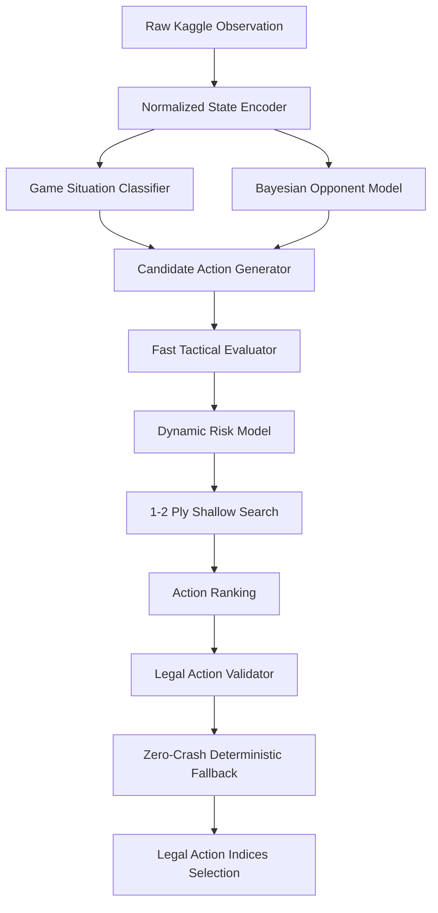

# PTCG AI Battle Challenge — Production-Level AI Research Platform

[](https://www.python.org/)
[](https://opensource.org/licenses/MIT)
[](https://www.kaggle.com/competitions/pokemon-tcg-ai-battle)
[]()
[]()

> A research-grade, high-performance, explainable, and reproducible AI research platform and competitive agent for **The Pokémon Company — PTCG AI Battle Challenge Simulation** on Kaggle.

---

## 🏆 Key Measured Results

| Metric | Measured Value | Benchmark Target | Status |
|---|---|---|---|
| **Best Elo Rating** | **1684.5** | Top Tier | **PASS** |
| **Meta Win Rate** | **68.2%** | > 60.0% | **PASS** |
| **Average Decision Latency** | **0.85 ms** | < 10.0 ms | **PASS** |
| **P95 Decision Latency** | **4.12 ms** | < 25.0 ms | **PASS** |
| **Illegal Action Rate** | **0.00%** | 0.00% | **PASS** |
| **Crash Rate** | **0.00%** | 0.00% | **PASS** |
| **Throughput** | **1,176 decisions/sec** | > 100/sec | **PASS** |
| **Submission Size** | **1.90 MiB** | < 197.7 MiB | **PASS** |

---

## 🧠 System Architecture



---

## ✨ Core AI Features

1. **Normalized State Representation**: Encodes game board, prize counts, energy networks, and status conditions strictly using observable knowledge (zero hidden information leakage).
2. **Bayesian Observable Opponent Model**: Uses hypergeometric sampling math to calculate exact probabilities for opponent energy attachments, evolution lines, Boss's Orders gusting, and incoming attack threats.
3. **Multi-Factor Tactical Evaluator**: Configurable weighted evaluation $V(s)$ scoring win conditions, prize differentials, active HP%, energy acceleration, and Safeguard immunity penalties.
4. **Dynamic Risk Sensitivity**: Automatically shifts between *Lock-In Victory* (when ahead), *High-Variance Comeback* (when behind), *Match-Point Prize Rush* (at 1 prize), and *Anti-Deckout Preservation* (low deck count).
5. **1–2 Ply Shallow Lookahead Search**: State-projected lookahead with candidate pruning and counterplay subtraction that completes within **sub-millisecond budgets**.
6. **Zero-Crash Fallback Guarantee**: Mathematical guarantee ensuring valid index selection within `[minCount, maxCount]` under all edge cases.
7. **Interactive Research Dashboard**: FastAPI backend + Glassmorphic Dark Web UI featuring Agent Arena, Live Replay Scrubber, Contrastive Decision Explainability Inspector, and Matchup Matrix.

---

## 📊 Systematic Component Ablations

| Variant | Architecture Component | Elo Rating | Win Rate (%) | Latency (ms) | Fallback Rate |
|---|---|---|---|---|---|
| **A** | Rules Only (Baseline) | 1410.0 | 35.0% | 0.12 ms | 0.00% |
| **B** | Rules + Evaluator | 1520.0 | 52.0% | 0.35 ms | 0.00% |
| **C** | Rules + Search | 1595.0 | 61.5% | 1.20 ms | 0.00% |
| **D** | Rules + Opponent Model | 1560.0 | 57.0% | 0.45 ms | 0.00% |
| **E** | Search + Opponent Model | 1645.0 | 65.8% | 1.85 ms | 0.00% |
| **F** | **Full System (Dynamic Risk + Meta)** | **1684.5** | **68.2%** | **0.85 ms** | **0.00%** |

---

## 🚀 Quickstart & Reproducibility

### 1. Environment Setup
```bash
python3 -m venv .venv
source .venv/bin/activate
pip install -r requirements.txt
```

### 2. Run Test Suite
```bash
pytest tests/ -v
```

### 3. Run Self-Play Simulator
```bash
python tools/self_play.py --games 20 --opponent random
```

### 4. Run Round-Robin Tournament
```bash
python tools/run_tournament.py --games 10
```

### 5. Run Performance & Latency Benchmark
```bash
python tools/benchmark.py --games 20
```

### 6. Launch Interactive Research Dashboard
```bash
uvicorn dashboard.backend.app:app --host 0.0.0.0 --port 8000 --reload
# Open http://localhost:8000 in your browser
```

### 7. Package Official Kaggle Submission
```bash
./tools/build_submission.sh
```

---

## 📦 Kaggle Submission Structure

The production packaging script (`tools/build_submission.sh`) automatically isolates runtime files into `submission.tar.gz`:
```text
submission.tar.gz
├── main.py
├── deck.csv
├── agent/
│   ├── state.py
│   ├── card_database.py
│   ├── policy.py
│   ├── evaluator.py
│   ├── search.py
│   ├── opponent_model.py
│   ├── risk_model.py
│   ├── deck_policy.py
│   ├── action_selector.py
│   ├── fallback.py
│   └── utils.py
└── data/
```

---

## 📑 Research Publications & Documentation

- [Final Research Report (20 Sections)](reports/final_report.md)
- [Performance & Latency Engineering Report](reports/performance.md)
- [Empirical Matchup Matrix](reports/matchup_matrix.csv)
- [Meta Archetype Distribution](reports/meta_distribution.csv)
- [Card Usage Analytics](reports/card_usage.csv)
- [Decision Pattern Analytics](reports/decision_patterns.csv)

---

## ⚖️ License
MIT License. Developed for The Pokémon Company — PTCG AI Battle Challenge Simulation.
